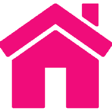

<div id="top"></div>

<h1 align="center">
    
</h1>

<p align="center">
<a href="https://raigyo-dev.be/" target="_blank"></a>
&nbsp;&nbsp;&nbsp;&nbsp;
<a href="https://www.linkedin.com/in/vincent-chilot/"  target="_blank">
  
</a>
</p>

<h2 style="color:f00c7a;" align="center">Welcome to my Github!</h2>

<p align="center">Hi, I'm Vincent aka Raigyo. I'm a web developer.</p>
<p align="center">I'm in the  development since 2001 and I worked for more than 16 years in a web agency.
<p align="center">Recently I followed a boot camp training
in web development at <a href="https://becode.org/">Becode</a>.</p>
<p align="center">I also develop in Unity since I made a traineeship in a company that was
involved in VR applications.</p>
<p align="center">To know more about my work and abilities, please visit my
<a href="https://raigyo-dev.be/" target="_blank">online portfolio</a>
or check my Github projects below, with direct links to the repositories.</p>

<h2 style="color:f00c7a;" align="center" id="status">Status</h3>

📊 Weekly development statistics:

<!--START_SECTION:waka-->

```text
TypeScript   4 hrs 23 mins   ████████████████░░░░░░░░░   63.88 %
HTML         2 hrs 21 mins   ████████▓░░░░░░░░░░░░░░░░   34.24 %
Markdown     7 mins          ▒░░░░░░░░░░░░░░░░░░░░░░░░   01.88 %
```

<!--END_SECTION:waka-->

<!-- https://medium.com/@JakenH/show-off-your-coding-stats-on-your-github-profile-using-wakatime-ce3ceb1063b5 -->

<table align="center">
  <tr>
    <th>🔭 I’m currently working on:</th>
    <th>🚀 Latest development(s):</th>
<!--     <th>⚡ Still in WIP</th> -->
  </tr>
  <tr>
    <td style="vertical-align:top"><a href="https://github.com/Raigyo/cms-nestjs">Nest JS & Angular</a>: CMS.</td>
    <td style="vertical-align:top"><a href="https://github.com/Raigyo/nest-js-todo">NestJS:</a>  Decorators, Pipes, Interceptors and Guards.&nbsp;&nbsp;&nbsp;&nbsp;&nbsp;&nbsp;&nbsp;&nbsp;</td>

<!--     <td style="vertical-align:top"><a href="https://github.com/Raigyo/ngrx-course">NgRx (with NgRx Data) - The Complete Guide</a>.</td> -->
  </tr>
  <tr>
    <td style="vertical-align:top"></td>
    <td style="vertical-align:top"><a href="https://github.com/Raigyo/vue-vuetify">Vue + Vuetify</a>: Vue with Vuetify, a Material Design Framework.</td>
<!--     <td style="vertical-align:top"></td> -->
  </tr>
</table>

<h2 style="color:f00c7a;" align="center">Repositories: personnal trainings and projects, Becode training</h2>

<h3 style="color:2ea2e9;" align="center" id="summary">Summary</h3>

<table align="center">
<tbody>
	<tr>
		<td>1. <a href="#html">HTML & CSS</a></td>
		<td>6. <a href="#vue">Vue 2 / 3</a></td>
	</tr>
	<tr>
		<td>2. <a href="#tools">Tools, Configs and Testing</a></a></td>
		<td>7. <a href="#svelte">Svelte</a></td>
	</tr>
	<tr>
		<td>3. <a href="#js">Javascript & NodeJS</a></td>
		<td>8. <a href="#php">PHP (Laravel / Symfony) / CMS (Wordpress / Drupal)</a></td>
	</tr>
	<tr>
		<td>4. <a href="#react">React / React Native</a></td>
		<td>9. <a href="#3d">WebGL / Unity 3D / C# / Virtual Reality</a></td>
	</tr>
	<tr>
		<td>5. <a href="#angular">Angular</a></td>
		<td>10. <a href="#becode">Becode group works</a></td>
	</tr>
</tbody>
</table>

<p id="html"></p>

<p>&nbsp;</p>

<h3 style="color:2ea2e9;" align="center">HTML & CSS</h3>

- [My portfolio](https://github.com/Raigyo/summary-portfolio): It uses static HTML, Flex and
  media queries.
- [Boostrap CSS Framework ](https://github.com/Raigyo/bootstrap-overview): Overview and showcase "Easy Job".
- [Bulma CSS Framework](https://github.com/Raigyo/bulma-overview): Overview and showcase websites "Site Immo" and "Portfolio".
- [TailwindCSS](https://github.com/Raigyo/tailwindcss-overview): Overview and showcase website "SEOTOOL".
- [Material Design](https://github.com/Raigyo/material-design-materialize-): Materialize CSS, overview and portfolio project inspired from Google Material Design.
- [CSS Animations](https://github.com/Raigyo/css-animations): How to animate with CSS.
- [CSS Flexbox](https://github.com/Raigyo/css-flexbox): Basic layout using Flexbox.
- [CSS Flexbox - Guide](https://github.com/Raigyo/css-flexbox-guide): Advanced use of Flexbox
  Layout Module.
- [CSS Grid](https://github.com/Raigyo/css-grid): Basics layout using Grid.
- [CSS Grid - Guide](https://github.com/Raigyo/css-grid-guide): Advanced use of Grid layout.
- [Mobirise](https://github.com/Raigyo/mobirise-band): Showcase project for a band using Mobirise
  Free Website Builder.
- [Bootstrap](https://github.com/Raigyo/bootstrap-corporate) (Becode): Creation of a corporate
  website using Bootstrap.

<p align="right"><a href="#top"></a></p>

<p id="tools"></p>

<p>&nbsp;</p>

<h3 style="color:2ea2e9;" align="center">Tools, Configs and Testing</h3>

- [Behavior-driven development (BDD) - Node.js](https://github.com/Raigyo/node-unit-testing-mocha): Unit Testing using Mocha ☕️, Chai and SinonJS.
- [SASS & SCSS](https://github.com/Raigyo/sass-scss): Overview of the CSS preprocessor (variables,
  nesting, mixins, inheritance...).
- [Parcel, Module Bundler](https://github.com/Raigyo/parcel-bundler): How to configurate Parcel.
  Eslint+Prettier, Babel, SASS, CSS postprocessor...
- [Webpack overview](https://github.com/Raigyo/webpack-overview): Webpack configuration with Babel, Sass, Eslint, Dev Server...
- [Webpack for React](https://github.com/Raigyo/webpack-react-hot-reload): Webpack with a focus
  on hot reload using Hot Module Replacement (HMR) in React with classes and persistant states during reload.
- [Webpack for React (Hooks)](https://github.com/Raigyo/webpack-react-hot-reload-hooks):
  React with hot reload using hooks.

<p align="right"><a href="#top"></a></p>

<p id="js"></p>

<p>&nbsp;</p>

<h3 style="color:2ea2e9;" align="center">Javascript & NodeJS</h3>

- [Canvas animations](https://github.com/Raigyo/canvas-javascript-animation): Animations using Canvas and Javascript.
- [Progressive web app](https://github.com/Raigyo/progressive-web-app): Progressive Web Apps: Service workers, Manifest, Cache, Notification Push, Background sync...
- [Socket I/O - chat](https://github.com/Raigyo/node-socket-io-chat): Chat application using SocketIO.
- [In the heart of Node](https://github.com/Raigyo/in-the-heart-of-node): Node advanced concepts overview including events emitters, streams, transform...
- [Web components](https://github.com/Raigyo/web-components): Web components overview using components displaying maps.
- [Restful API: members](https://github.com/Raigyo/node-restfulapi): Restful API using NodeJS+Express and MySQL to manage a list of members. Backend and frontend part + Swagger and Gitbook documentation.
- [D3.js: charts](https://github.com/Raigyo/d3js-overview): Data-Driven Documents library, animated and dynamic charts using Firebase.
- [Libray Management](https://github.com/Raigyo/express-locallibrary): REST API with Express.js
  using Mongoose ORM / MongoDB Atlas.
- [Javascript for the web](https://github.com/Raigyo/becode-js-for-the-web) (Becode): Exercises
  about javascript for the web: use of Parcel.JS and strict mode, forms, API requests...

<p align="right"><a href="#top"></a></p>

<p id="react"></p>

<p>&nbsp;</p>

<h3 style="color:2ea2e9;" align="center">React / React Native</h3>

- [React and Redux: fundamental and advanced](https://github.com/Raigyo/redux-new-york-time): Application displaying articles from New-York Times using Redux, Hooks and Context API.
- [Next JS - Full stack web application with Next.js, TypeScript and GraphQL](https://github.com/Raigyo/next-js-stream-me): Medias sharing plateform using strongly typed Next.js (using Typescript), MongoDB, Apollo Client and Sever (GraphQL).
- [JAMStack - Gatsby portfolio](https://github.com/Raigyo/gatsby-wp-portfolio): Portfolio project with Gatsby to generate static site using Wordpress as headless CMS API and GraphQL.
- [React Twitch clone using Hooks](https://github.com/Raigyo/react-hooks-twitch-clone): Twitch clone using React with hooks and Twitch API v5.
- [Online Store](https://github.com/Raigyo/react-online-store): Store made with React,
  Strapi headless CMS with GraphQL & Stripe for online payments.
- [React Netflix](https://github.com/Raigyo/react-netflix-clone): Clone of Netflix using Redux,
  React Router DOM, Firebase, Paypal (Sand Box), React Player, _themoviedb_ API.
- [Chatty](https://github.com/Raigyo/react-chat): Real-Time Chat App with React and Google Firebase - Connection with Email, Github, Facebook or Google.
- [Native: Tinder UI Clone](https://github.com/Raigyo/react-native-swipe): In this application,
  we can swipe between images that move or come back in their position like in Tinder app.
- [Native: Facebook Login](https://github.com/Raigyo/react-native-fb-login): Log to an app with
  a Facebook account.
- [React 360 / React VR](https://github.com/Raigyo/react-vr-apps): Several applications
  using the Facebook React VR/360 library.
- [Native: My Video Library](https://github.com/Raigyo/video-library) (Becode): Video library mobile
  application using _themoviedb_ API to retrieve movies. Use Redux and ejection concept (Expo to CLI). Then migration on Google Play.
- [React hooks](https://github.com/Raigyo/React-Hooks-Workshop) (Becode): Workshop by Matthieu Jasselette & Alexandre Bove.
- [Character Manager](https://github.com/Raigyo/react-character-manager) (Becode):
  Characters manager with ReactJS (CRUD with API).

<p align="right"><a href="#top"></a></p>

<p id="angular"></p>

<p>&nbsp;</p>

<h3 style="color:2ea2e9;" align="center">Angular 9 => 13</h3>

- [Pokémons app](https://github.com/Raigyo/angular-pokemons): Angular application of Pokémons from an empty folder, with Angular and TypeScript.
- [MEAN Stack - Dev Blog](https://github.com/Raigyo/mean-stack-whisky): Blog for developers using Node and Express, MongoDB and Mongoose as ODM, and Angular on Client side (MEAN Stack).
- [Restaurant Website](https://github.com/Raigyo/angular-restaurangular): This application covers
  the basics concepts of Angular and RxJS: materials, reactive forms, observables...

<p align="right"><a href="#top"></a></p>

<p id="vue"></p>

<p>&nbsp;</p>

<h3 style="color:2ea2e9;" align="center">Vue 2 / 3</h3>

- [Vue + Vuetify](https://github.com/Raigyo/vue-vuetify): Todo app using Vue, Vuetify and VueX.
- [Vue3 and composition API](https://github.com/Raigyo/progressor-compo-api): Tasks manager with CRUD.
- [Book Shop application](https://github.com/Raigyo/vuex-shop): Online shop using VueX,
  Axios and JSon Server.
- [Ideas manager / Kanban](https://github.com/Raigyo/vuex-ideas): Brainstorming with drag and
  drop using VueX.
- [Contact Manager](https://github.com/Raigyo/vue-contact-manager): Contact cards app using Google Cloud Firestore to store datas.

<p align="right"><a href="#top"></a></p>

<p id="svelte"></p>

<p>&nbsp;</p>

<h3 style="color:2ea2e9;" align="center">Svelte</h3>

- [Mini-blog](https://github.com/Raigyo/sapper-strapi-blog-static): A Static Blog With Sapper And Strapi.
- [Expense calculation application](https://github.com/Raigyo/svelte-sapper-spending):
  Simple application to calculate expenses.
- [Pokédex](https://github.com/Raigyo/svelte-sapper-pokedex): Page displaying a list
  of Pokémons fetched from a Pokémon API.
- [Svelte Overview](https://github.com/Raigyo/svelte-overview): Svelte main concepts: stores,
  reactive methods, components lifecycle...

<p align="right"><a href="#top"></a></p>

<p id="php"></p>

<p>&nbsp;</p>

<h3 style="color:2ea2e9;" align="center">PHP (Laravel / Symfony) / CMS (Wordpress / Drupal)</h3>

- [Symfony 5](https://github.com/Raigyo/symfony-monitoring): Monitoring application.
- [Drupal: Bar Cat](https://github.com/Raigyo/drupal-bar-cat): A blog made with Drupal 9.
- [Wordpress: Foo Dog](https://github.com/Raigyo/wordpress-foo-dog) (Becode): A blog made with Wordpress
  from scratch. All the features were developed in blank theme.
- [API with Laravel](https://github.com/Raigyo/laravel-api) (Becode): CRUD using Tinker,
  Unit testing, Web interface with CRUD.
- [Basic configuration](https://github.com/Raigyo/laravel-basics) (Becode): installation
  of the Framework, featuring contact form to send an email and sending an image that will be
  hosted on the server.

<p align="right"><a href="#top"></a></p>

<p id="3d"></p>

<p>&nbsp;</p>

<h3 style="color:2ea2e9;" align="center">WebGL / Unity 3D / C# / Virtual Reality</h3>

- [Three.js and TypeScript](https://github.com/Raigyo/threejs-typescript): Threejs, TypeScript and NodeJS to create interactive 3D content on the web.
- [Three.js, TypeScript and SocketIO](https://github.com/Raigyo/three-js-ball-game): Multiplayers Ball game.
- [Three.js](https://github.com/Raigyo/three-js): 3D Programming with JavaScript
  and the Three.js 3D library.
- [Archviz - Virtual Reality for Oculus Rift](https://github.com/Raigyo/unity-3d-archviz-vr-oculus):
  Visit a non existing house in a realistic 3D environment.
  It's the VR version for the Oculus Rift of my 'Archviz' work.
- [Archviz](https://github.com/Raigyo/unity-3d-archviz): _Original_ house visit development.
  There are 3 modes: Hotspots mode, First Person Mode or Cinematic mode. You can select which mode
  you want to use in the main menu.
- [A Forest](https://github.com/Raigyo/unity-3d-game-forest): _Original_ game
  development - 'A Forest'.
- [Babylon.js](https://github.com/Raigyo/fps-babylon-js): Online Multiplayer -First Personnal Shooter using SocketIO.
- [Terminal Hacker](https://github.com/Raigyo/unity-terminal-hacker): WebGL quiz made with Unity 3D.

<p align="right"><a href="#top"></a></p>

<p id="becode"></p>

<p>&nbsp;</p>

<h3 style="color:2ea2e9;" align="center">Becode group works</h3>

- [Workshop React Native](https://github.com/Raigyo/workshop-react-native): Workshop given
  with Lara Loicq to introduce **React Native** with **Expo**.
- [Super Socket Fighter](https://github.com/Raigyo/SuperSocketFighter): Videogame online
  using **React** as client-side and **Node.JS/Websockets/Socket IO** as server-side.
- [Event Manager - Event Dab](https://github.com/Raigyo/group-project-react-laravel-v2): Event manager
  using **React** as front-end and **Laravel** that provides the API.
- [Event Manager (fork) - Do Nut Events](https://github.com/Raigyo/group-project-react-laravel-fork-v2):
  Same application using **React** and **Laravel** but forked from the work of another group.
  Bugs had to be corrected and new features had to be implemented.
- [Blog PHP](https://github.com/Raigyo/becode-php-blog): Client server application using **PHP**
  that allows users to post articles, comment them or delete them according their user rights.
  Using **PHP Slim framework**.
- [Bad Ideas Kanban](https://github.com/Raigyo/jepsen-js-web-majopovi): **Javascript** CRUD
  and Api request. A group exercice for getting better at working together with **Git**.

<p align="right"><a href="#top"></a></p>

<p align="center">
  
</p>

<p align="center">
  
  <!--  -->
  
</p>

<!--
**Raigyo/Raigyo** is a ✨ _special_ ✨ repository because its `README.md`
(this file) appears on your GitHub profile.

Here are some ideas to get you started:

- 🔭 I’m currently working on ...
- 🌱 I’m currently learning ...
- 👯 I’m looking to collaborate on ...
- 🤔 I’m looking for help with ...
- 💬 Ask me about ...
- 📫 How to reach me: ...
- 😄 Pronouns: ...
- ⚡ Fun fact: ...

Stats:

[](https://github.com/anuraghazra/github-readme-stats)

[WakaTime Coding Statistics](https://github.com/marketplace/actions/waka-readme)

Exemple:

[stephenajulu/README.md](https://github.com/stephenajulu/stephenajulu/blob/master/README.md)

Useful Links:

- [Creating amazing GitHub profiles README](https://dev.to/diogorodrigues/creating-amazing-github-profiles-readme-5h31)
- [You can also learn how to [build a self-updating profile](https://simonwillison.net/2020/Jul/10/self-updating-profile-readme/)
- [Learn how to add shields into the content](https://shields.io/)
- [Learn how to add GitHub Readme Stats on your readmes!](https://github.com/anuraghazra/github-readme-stats#github-stats-card)
- [See how to add Emoticon](https://gist.github.com/rxaviers/7360908)
-->
